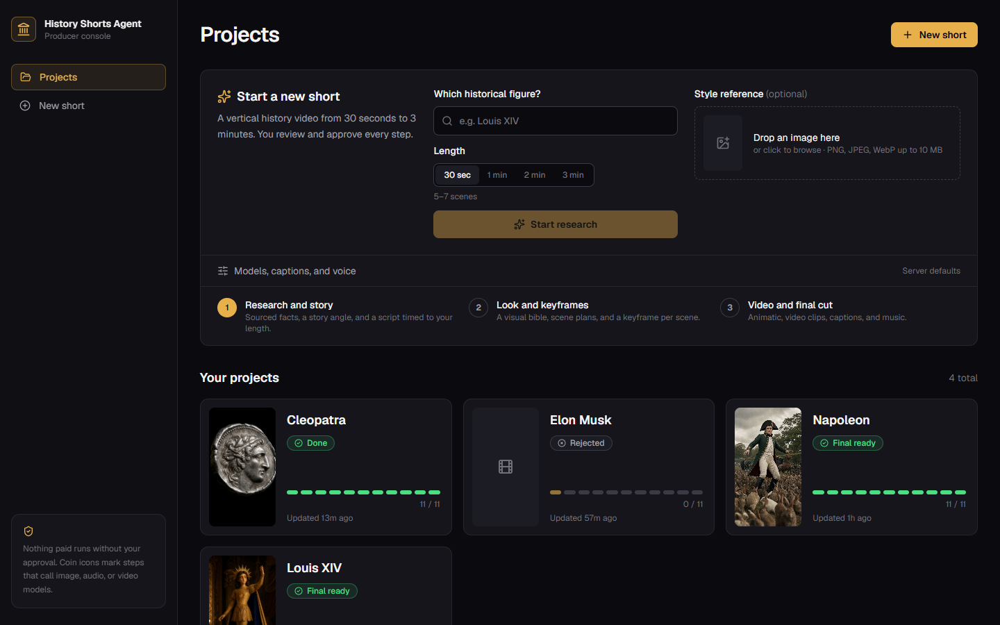
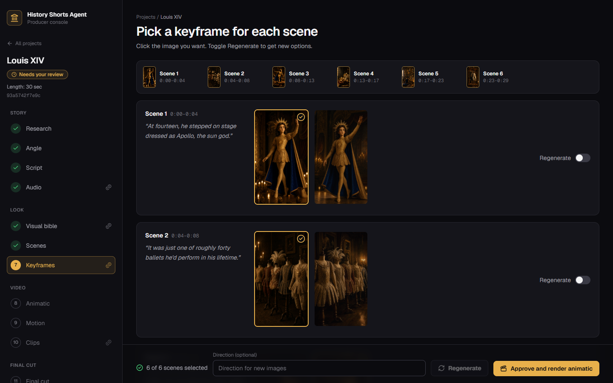
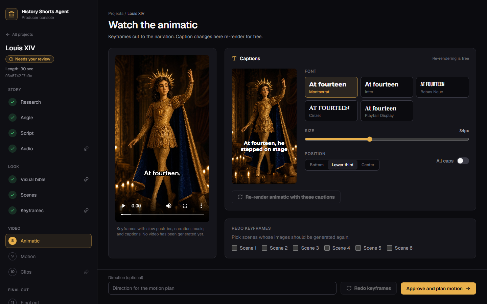
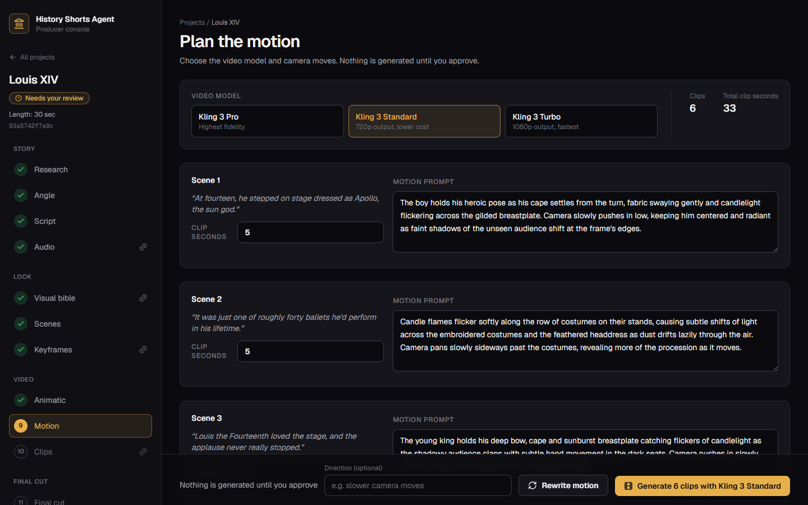
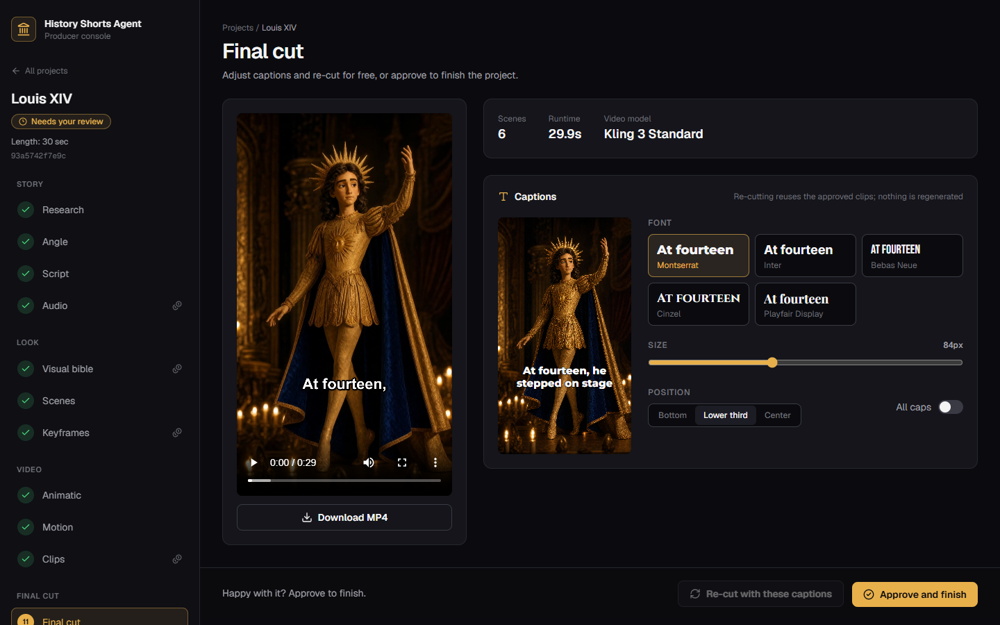

# History Shorts Agent

A human-in-the-loop agent that turns a historical figure into a vertical story video: a 30-second short or a 1-, 2-, or 3-minute story. The chosen length sets the research depth, story structure, word budget, and scene count.

Claude researches the figure with web search, proposes story angles, writes the narration, and designs every scene. Magnific generates the character reference and keyframes with GPT Image 2, and the background music. ElevenLabs voices the narration. A producer reviews and steers each stage before anything expensive happens.

> Status: MVP 3. The pipeline runs from topic to a finished vertical video: a keyframe animatic for review, then Kling 3 clips cut to the narration. A Next.js review console covers every stage, with per-project length, image and video models, and caption styling. It runs on Google Cloud Run behind Identity-Aware Proxy, with Cloud SQL checkpoints and assets in Cloud Storage.



| Keyframes | Animatic and caption styling |
|---|---|
|  |  |
| **Motion plan and video model** | **Final cut** |
|  |  |

## Pipeline

```mermaid
flowchart TD
    A[Topic] --> R[Research<br/>web search + fact sheet]
    R --> G1{Review}
    G1 -->|revise| R
    G1 --> AN[Story angles<br/>+ fact check] --> G2{Pick one}
    G2 -->|revise| AN
    G2 --> S[Script + fact check<br/>word budget and scenes set by length] --> G3{Review}
    G3 -->|revise| S
    G3 --> AU[Narration + timestamps<br/>Music bed] --> G4{Review}
    G4 -->|revise| AU
    G4 --> B[Visual bible<br/>character sheet per look] --> G5{Review}
    G5 -->|revise| B
    G5 --> SC[Scene writer] --> C[Critic<br/>anachronisms, character looks, facts]
    C -->|issues| SC
    C --> G6{Review}
    G6 -->|revise| SC
    G6 --> K[Keyframes<br/>N candidates per scene] --> G7{Select}
    G7 -->|regenerate| K
    G7 --> P[Animatic<br/>push-ins, captions, ducked music] --> G8{Review}
    G8 -->|regenerate| K
    G8 --> M[Motion prompts] --> G9{Approve clip plan}
    G9 -->|revise| M
    G9 --> V[Kling 3 clips<br/>one per scene, in parallel] --> G10{Review}
    G10 -->|regenerate| V
    G10 --> F[Final cut<br/>clips fitted to narration] --> G11{Review}
    G11 -->|re-cut captions| F
```



`GET /graph` returns the live diagram generated from the compiled LangGraph.

## Design decisions

- **Workflow, not an autonomous agent.** The stages are known, so LangGraph runs a fixed graph. Model judgment lives inside nodes (research, writing, critique), and a person approves each stage.
- **Review gates are separate nodes.** LangGraph re-runs a whole node when it resumes from `interrupt()`, so work nodes never pause. That keeps a resume from paying for a second generation.
- **Accuracy is structural.** Every fact carries a status (`verified`, `disputed`, `legend`) and cites sources rated `scholarly`, `reference`, or `popular`. Code, not the model, enforces the rule that a fact backed only by popular sources cannot be `verified`. Story angles and the script each go through a fact-check pass against the fact sheet and are rewritten until unsupported claims are gone (up to `MAX_FACT_REWRITES`). A critic checks scenes for anachronisms, contradictions, and mismatched character looks before any image is generated.
- **Length is a story shape, not a stretch.** Each length (30 seconds, 1, 2, or 3 minutes) is a profile: how many facts to research, the story structure (one turn for a short, three acts with a midpoint reversal at 3 minutes), the word budget at 155 words per minute, and the scene count. Scenes stay short enough for one Kling clip each. The length can change until research is approved, because everything after it is written for that length.
- **Audio sets the timing.** Narration is generated before visuals. ElevenLabs character timestamps set each scene's exact duration and drive word-level captions.
- **Style by example, identity by reference.** A producer can upload a style reference image. Claude reads it to write the visual bible, and GPT Image 2 renders a character sheet in that style for each look the story needs, such as a young and a mature version of the same person. Each scene names the look it shows, and its keyframe gets that character sheet plus the style image as references, with the prompt stating each image's role, so faces and the style stay consistent across scenes.
- **Spend where review says so.** Video is the expensive step. The pipeline first renders a free animatic from the keyframes, then shows the clip count and total seconds before any clip is generated. Clip lengths follow the narration, rounded up to Kling's whole seconds and trimmed in the edit. A failed clip doesn't discard the clips that succeeded, and generation requests are never retried on errors that may already have created a billed task. Image and video models are chosen per project and can be switched at the gate right before they are used.
- **Free iteration where it's cheap.** Caption font, size, position, and case are applied at render time, so the animatic and the final cut can be re-rendered with new captions without regenerating any image or clip. Five OFL fonts ship with the renderer and are passed to libass through `fontsdir`, so captions look the same on any machine.
- **Guardrail on real people.** Only figures who died at least 75 years ago are accepted (`MIN_YEARS_SINCE_DEATH`).
- **Official Anthropic SDK inside LangGraph nodes.** Web search, structured outputs, and server-side refusal fallbacks are used directly, with no wrapper layer. Langfuse traces each run as a session per project.

## Stack

| Concern | Choice |
|---|---|
| Review console | Next.js 16, React 19, Tailwind CSS 4 |
| API | FastAPI |
| Orchestration | LangGraph, Postgres checkpointer |
| LLM | Claude (`claude-sonnet-5`) with web search and structured outputs |
| Images, music | Magnific API: GPT Image 2 (Seedream 4.5 selectable), Music Generation |
| Video | Magnific API: Kling 3 Pro image-to-video (Std and Turbo selectable) |
| Narration | ElevenLabs TTS with timestamps |
| Rendering | FFmpeg, libass captions with bundled OFL fonts |
| Tracing | Langfuse (optional) |
| Storage | Local disk, or Google Cloud Storage served through signed-URL redirects |
| Hosting | Cloud Run (console with the API as a sidecar), Identity-Aware Proxy, Cloud SQL, Secret Manager, Cloud Build |

## Run locally

Requirements: Python 3.12+, [uv](https://docs.astral.sh/uv/), Docker, FFmpeg on `PATH`.

```bash
docker compose up -d postgres          # Postgres on localhost:5433
cd backend
cp .env.example .env                   # add Anthropic, Magnific, ElevenLabs keys and a voice id
uv sync
uv run python -m app                   # http://127.0.0.1:8000/docs
```

Run `uv run python -m app` rather than `uvicorn` directly. On Windows it selects an event loop that psycopg's async driver supports.

Then start the review console in a second terminal:

```bash
cd frontend
npm install
npm run dev                            # http://localhost:3000
```

The console proxies `/api/*` and `/files/*` to the API (`BACKEND_URL`, default `http://127.0.0.1:8000`), so the backend needs no CORS setup.

## Deploy

`deploy/deploy.sh` builds both images with Cloud Build and rolls out one Cloud Run service: the Next.js console takes all traffic and the FastAPI agent runs beside it as a sidecar, so the API has no public endpoint. Identity-Aware Proxy admits only granted Google accounts. The service scales to zero with at most one instance, because projects run as in-process background tasks and can resume from their Postgres checkpoint. See [deploy/README.md](deploy/README.md) for the one-time setup.

## Using the API

```bash
# Optional: upload a style reference image
curl -X POST localhost:8000/uploads -F "file=@style_ref.png"   # -> {"key": "uploads/..."}

# Start a project; research runs in the background
curl -X POST localhost:8000/projects -H "Content-Type: application/json" \
  -d '{"topic": "Louis XIV", "style_ref_key": "uploads/...", "target_seconds": 60}'

# Lengths, models, caption fonts, and server defaults
curl localhost:8000/options

# Poll: `stage` and `payload` show what is waiting for review; `assets` maps files to URLs
curl localhost:8000/projects/<id>

# Resume with a decision
curl -X POST localhost:8000/projects/<id>/decisions -H "Content-Type: application/json" \
  -d '{"action": "select", "choice": 0}'
```

| Stage | Actions |
|---|---|
| `research` | `approve`, `revise` (`feedback`; `edits.topic` switches figure; `edits.target_seconds` changes the length) |
| `angle` | `select` (`choice`), `revise` |
| `script` | `approve` (optional `edits.narration`: one string per segment), `revise` |
| `audio` | `approve`, `revise` (`edits.regenerate`: `["narration", "bgm"]`, `edits.voice_id`) |
| `bible` | `approve`, `revise` (`edits.image_only: true` redraws only the character sheets; `edits.style_ref_key` sets a new style reference) |
| `scenes` | `approve` (optional `edits.scenes`: per-scene overrides), `revise` |
| `keyframes` | `approve` (`edits.selections`: `{"3": 1}`), `regenerate` (`scene_orders`, `feedback`) |
| `preview` | `approve`, `revise` (`edits.caption_style` re-renders the animatic), `regenerate` (`scene_orders`, `feedback`: redo keyframes) |
| `motion` | `approve` (optional `edits.shots`: `video_prompt`, `clip_seconds` per scene), `revise` |
| `clips` | `approve` (`edits.selections`), `regenerate` (`scene_orders`, `feedback`) |
| `final` | `approve` finishes the project, `revise` (`edits.caption_style` re-cuts from the approved clips) |

`edits.image_model` and `edits.image_quality` are accepted at `bible`, `scenes`, and `keyframes`; `edits.video_model` at `motion` and `clips`. `caption_style` takes `font`, `size` (48–140 px on a 1080×1920 frame), `position` (`bottom`, `lower-third`, `center`), and `uppercase`.

`feedback` on `revise` or `regenerate` reshapes the current stage. On `approve` or `select`, it becomes direction for the next stage, for example approving research with "focus on his ballet years".

If a node fails, for example on a provider error, `POST /projects/<id>/retry` resumes from the last checkpoint.

## Tests

```bash
cd backend
uv run pytest
```

The suite drives the full graph through every gate with fake providers, including the fact-check and critic loops, a length change, model switches, keyframe and clip regeneration, and caption re-renders. It also covers length profiles, caption styles, timing alignment, Magnific task polling, and the streaming Claude client, and renders real 1080×1920 videos with bundled caption fonts when FFmpeg is installed.

## Roadmap

1. Durable execution: Cloud Tasks or Cloud Run jobs for generation, and Magnific webhooks in place of polling, so runs survive scale-down and can use more than one instance. Terraform and CI.
2. Evals: fact grounding rate, critic catch rate, reviewer approval rate per stage.
