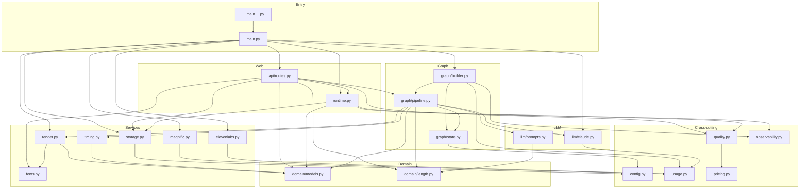
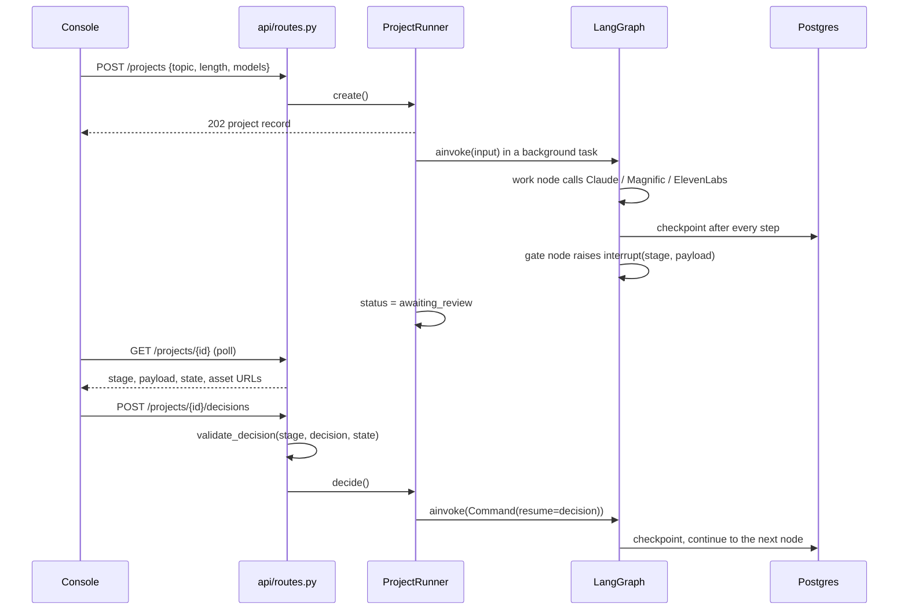

# Backend

The agent itself: a FastAPI app around a LangGraph workflow that turns a historical figure into a vertical video, pausing at eleven review gates.

Run it with `uv run python -m app` (see the [root README](../README.md) for environment setup). This file explains how the code is organised, how the modules depend on each other, and how a run moves through the graph.

## Layout

```
app/
  __main__.py          uv run python -m app; selects an event loop psycopg supports on Windows
  main.py              FastAPI app, lifespan: builds Deps, opens the checkpointer, mounts /files
  config.py            Settings from .env (models, keys, storage, checkpointer, limits)
  runtime.py           ProjectRecord/Registry and ProjectRunner: background runs, status, metrics cache
  usage.py             usage collector: providers record tokens and media units into graph state
  quality.py           review, fact-check, critic, media and cost metrics read back from checkpoints
  pricing.py           Claude list prices; cost of one recorded call
  observability.py     optional Langfuse tracing and per-project scores (no-op without keys)
  api/
    routes.py          HTTP surface: projects, decisions, options, uploads, metrics, /files redirect
  domain/
    models.py          Pydantic models: fact sheet, script, bible, scenes, captions, gate decision
    length.py          length profiles (30 s, 1, 2, 3 min): facts, words, segments, story shape
  graph/
    state.py           ProjectState channels and Deps (the services a pipeline node may call)
    pipeline.py        every node and gate, plus decision validation
    builder.py         wires nodes, gates and routes into the graph; opens the checkpointer
  llm/
    claude.py          Anthropic SDK calls: web research, streamed structured outputs, usage
    prompts.py         prompt templates; context is passed as XML-tagged JSON
  services/
    magnific.py        images, video and music: create task, poll, download
    elevenlabs.py      text-to-speech with character-level timestamps
    render.py          FFmpeg: animatic, final cut, ASS captions
    fonts.py           the five bundled caption fonts (OFL)
    storage.py         local disk or GCS behind one key-based interface
    timing.py          character alignment to word and scene timings
    media.py           image type sniffing
assets/fonts/          caption fonts and their licenses
tests/                 33 tests; the graph runs end to end with fake providers
```

## Module map

Dependencies point one way: `domain` imports nothing, `services` depend on `domain` and `config`, the graph depends on services and the LLM layer, and the web layer depends on the graph.



`Deps` in `graph/state.py` is the seam: `main.py` builds the real clients, tests build fakes, and `pipeline.py` only ever sees the interface.

## The graph

Work nodes generate; gate nodes only pause and route. They are separate because LangGraph re-runs a whole node when it resumes from `interrupt()` — keeping them apart means a resume never repeats paid work.

```mermaid
flowchart TD
  START([start]) --> research
  research --> gate_research{research}
  gate_research -->|revise| research
  gate_research -->|not eligible| DONE([done])
  gate_research --> angles
  angles --> gate_angle{angle}
  gate_angle -->|revise| angles
  gate_angle -->|select| script
  script --> gate_script{script}
  gate_script -->|revise| script
  gate_script --> audio
  audio --> gate_audio{audio}
  gate_audio -->|revise| audio
  gate_audio --> bible
  bible --> gate_bible{bible}
  gate_bible -->|revise| bible
  gate_bible --> scenes
  scenes --> critic
  critic -->|issues, under round limit| scenes
  critic --> gate_scenes{scenes}
  gate_scenes -->|revise| scenes
  gate_scenes --> keyframes
  keyframes --> gate_keyframes{keyframes}
  gate_keyframes -->|regenerate| keyframes
  gate_keyframes --> preview
  preview --> gate_preview{animatic}
  gate_preview -->|revise captions| preview
  gate_preview -->|regenerate| keyframes
  gate_preview --> motion
  motion --> gate_motion{motion}
  gate_motion -->|revise| motion
  gate_motion --> clips
  clips --> gate_clips{clips}
  gate_clips -->|regenerate| clips
  gate_clips --> final
  final --> gate_final{final cut}
  gate_final -->|re-cut captions| final
  gate_final -->|approve| DONE
```



`GET /graph` returns the same picture generated from the compiled graph, so it cannot drift from the code.

The wiring lives in two tables in `graph/builder.py`: `REVIEWED_BY` maps each work node to its gate, `GATE_ROUTES` lists where each gate may go. Adding a stage means adding a node method, one entry in each table, and a payload the console can render.

## How a run moves



A failed run keeps its checkpoint: `POST /projects/{id}/retry` re-invokes with `None`, which re-runs the failed node only.

## State channels

Everything the graph knows lives in `ProjectState` (`graph/state.py`) as JSON-compatible values. Storage keys, not bytes.

| Group | Channels |
|---|---|
| Identity | `project_id`, `topic`, `status`, `feedback` |
| Producer choices | `target_seconds`, `image_model`, `image_quality`, `video_model`, `caption_style` |
| Story | `fact_sheet`, `eligibility`, `angles`, `selected_angle`, `script`, `fact_checks`, `fact_check_stats` |
| Audio | `voice_id`, `audio_targets`, `narration`, `bgm` |
| Look | `style_ref_key`, `bible`, `bible_image_only`, `character_refs` |
| Scenes | `scenes`, `critic_report`, `critic_rounds` |
| Frames | `keyframes`, `selected_keyframes`, `regen_orders`, `preview_key` |
| Video | `clips`, `selected_clips`, `clip_errors`, `regen_clip_orders`, `final_key` |
| Spend | `usage` (the only reducer channel: every node appends) |

## Files in detail

| File | What it does | Depends on |
|---|---|---|
| `main.py` | Builds `Deps` (Claude, Magnific, ElevenLabs, storage, renderer), opens the checkpointer, mounts `/files` for local storage, includes the router | everything below |
| `api/routes.py` | `/projects`, `/projects/{id}`, `/decisions`, `/retry`, `/options`, `/uploads`, `/metrics`, `/graph`, and the GCS `/files` redirect; validates decisions before they reach the graph | runtime, quality, pipeline, domain, services |
| `runtime.py` | Project index in storage, background task per run, status transitions, thumbnail pick, metrics cache, Langfuse scores after a run | quality, observability, storage, models |
| `graph/builder.py` | `build_graph()` wires nodes, gates, routes and the usage collector; `open_checkpointer()` yields Postgres or in-memory | pipeline, state, observability, usage |
| `graph/pipeline.py` | All node and gate methods, the fact-check and critic loops, clip planning, render calls, and `validate_decision()` | state, domain, llm, render, timing |
| `graph/state.py` | `ProjectState` channels and the `Deps` dataclass | config |
| `domain/models.py` | 25 Pydantic models used both as LLM output schemas and as state shapes; field descriptions are part of the prompt | – |
| `domain/length.py` | Length profiles: facts to research, words, segments, scene seconds, story structure | – |
| `llm/claude.py` | `research()` with the web search tool and `pause_turn` continuation; `generate()` streams a structured output and records usage | usage, media |
| `llm/prompts.py` | One function per prompt; producer direction and reviewer findings are appended by `_guidance()` | length |
| `services/magnific.py` | GPT Image 2, Seedream, Kling 3, music; task creation, polling, upload; retries only on 429/503 | usage |
| `services/elevenlabs.py` | TTS with timestamps | usage |
| `services/render.py` | Filter graph for animatic and final cut, ASS caption file, fonts directory | models, fonts |
| `services/fonts.py` | The five bundled caption faces and their ASS names | – |
| `services/storage.py` | `put/get/exists/url` over local disk or GCS; signed URLs cached and signed through the IAM API | config |
| `services/timing.py` | Character alignment to word and segment timings | models |
| `usage.py` | `record()` from providers, `collect()` wraps a node so usage lands in state | – |
| `quality.py` | Reads gate decisions from checkpoint pending writes and fact checks, critic reports and media from state history | pricing |
| `pricing.py` | Claude token and web search prices | – |
| `observability.py` | Langfuse spans per node, one session per project, quality scores | – |
| `config.py` | Typed settings with defaults for every model, limit and path | – |

## Storage keys

```
projects/index.json                              the project registry
projects/<id>/audio/narration-<hash>.mp3         voice
projects/<id>/audio/bgm-<hash>.mp3               music bed
projects/<id>/bible/character-<look>-<hash>.png  character sheets
projects/<id>/keyframes/scene-<n>-<hash>.png     keyframe candidates
projects/<id>/clips/scene-<n>-<hash>.mp4         video clips
projects/<id>/preview/preview-<hash>.mp4         animatic
projects/<id>/final/final-<hash>.mp4             final cut
uploads/<hash>.png                               style reference uploads
```

Locally these are files under `data/` served at `/files`. With `STORAGE_BACKEND=gcs` the same keys live in a private bucket and `/files/<key>` redirects to a signed URL.

## Where to change things

| Task | Touch |
|---|---|
| Add a review stage | a node method and a gate method in `pipeline.py`, one line in `REVIEWED_BY` and `GATE_ROUTES` (`builder.py`), the allowed actions in `STAGE_ACTIONS`, and a console panel |
| Add an image or video model | `config.py` literals, the call in `services/magnific.py`, the option list in `api/routes.py` |
| Add a caption font | the font file and its license in `assets/fonts/`, one entry in `services/fonts.py` |
| Change how a length behaves | one profile in `domain/length.py`; prompts read it |
| Change what a stage asks the model | the matching function in `llm/prompts.py`, and the schema in `domain/models.py` if the shape changes |
| Track a new number | `usage.record()` at the provider, then an aggregation in `quality.py` |

## Tests

```bash
uv run pytest          # 33 tests, no API keys needed
```

| File | Covers |
|---|---|
| `test_pipeline.py` | the whole graph with fake providers: every gate, fact-check rewrites, the critic loop, a length change, model switches, a failed clip, caption re-cuts |
| `test_quality.py` | metrics read back from a metered run, and pricing |
| `test_render.py` | caption grouping and style, the FFmpeg command, and two real 1080×1920 renders when FFmpeg is installed |
| `test_magnific.py` | task polling, the Kling upload path, and that POSTs are not retried after a 500 |
| `test_claude.py` | streamed structured output and the truncation guard |
| `test_length.py` | length profiles and prompt scaling |
| `test_timing.py` | character alignment to scene timings |
